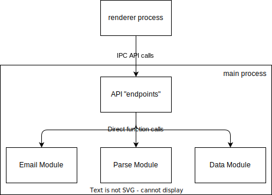

# Email Wizard Desktop

A desktop version of [Email Wizard](https://github.com/dongmingli-Ben/email-wizard), built with Electron, React, Typescript, and Webpack.

## How to set up

Install `nodejs` and `npm`.

Then clone this repo:

```bash
git clone https://github.com/dongmingli-Ben/email-wizard-desktop.git
```

Install dependencies:

```bash
npm install
```

Rebuild the dependencies for `better-sqlite3` with [`electron/rebuild`](https://github.com/electron/rebuild):

```bash
# windows
.\node_modules\.bin\electron-rebuild.cmd
# mac/linux
$(npm bin)/electron-rebuild
```

Note that for developer, each time a new package is installed via `npm install`, you need to rebuilt the package with the above command.

Run the app with webpack dev server:

```bash
npm start
```

Package the app:

```bash
npm run package
```

## Tasks

- [ ] UI accomodation
  - [x] remove sign in and register page
  - [ ] change intro page (when user has not added any mailbox) to a "empty" page (Peng)
    - [ ] ask for new mailbox if there isn't one already
    - [ ] ask for openai api key if it is not already set
  - [ ] migrate all `<Link>`s to open in an external browser
- [ ] UI improvement
  - [ ] "n more" display (Dongming, Peng)
    - [ ] set the left bar of the calendar page to be fixed
    - [ ] use one overflow bar other than two in the calendar page when there are so many events that the calendar overflows
    - [ ] fixed-height calendar cell?
  - [ ] more beautiful tooltip display when hovering over events?
  - [ ] responsive layout (Peng)
- [x] function migration (Dongming)
  - [x] change Outlook and Gmail's Oauth2 flow to the one suited for desktop application
  - [x] change database to local data
    - [x] update schema
    - [x] implement CRUD functionalities with JS/TS
    - [x] migrate data logic
  - [x] migrate fetch and clean email to JS/TS
  - [x] migrate LLM API calls to JS/TS
  - [x] update backend API calls to local services
- [ ] release
  - [ ] web
  - [ ] windows store
  - [ ] mac store

## Architecture


